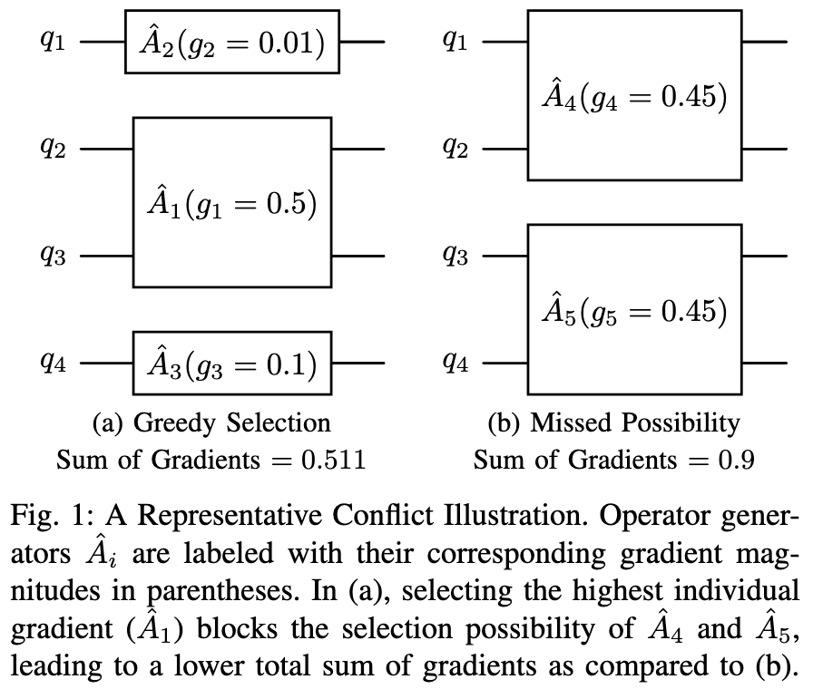
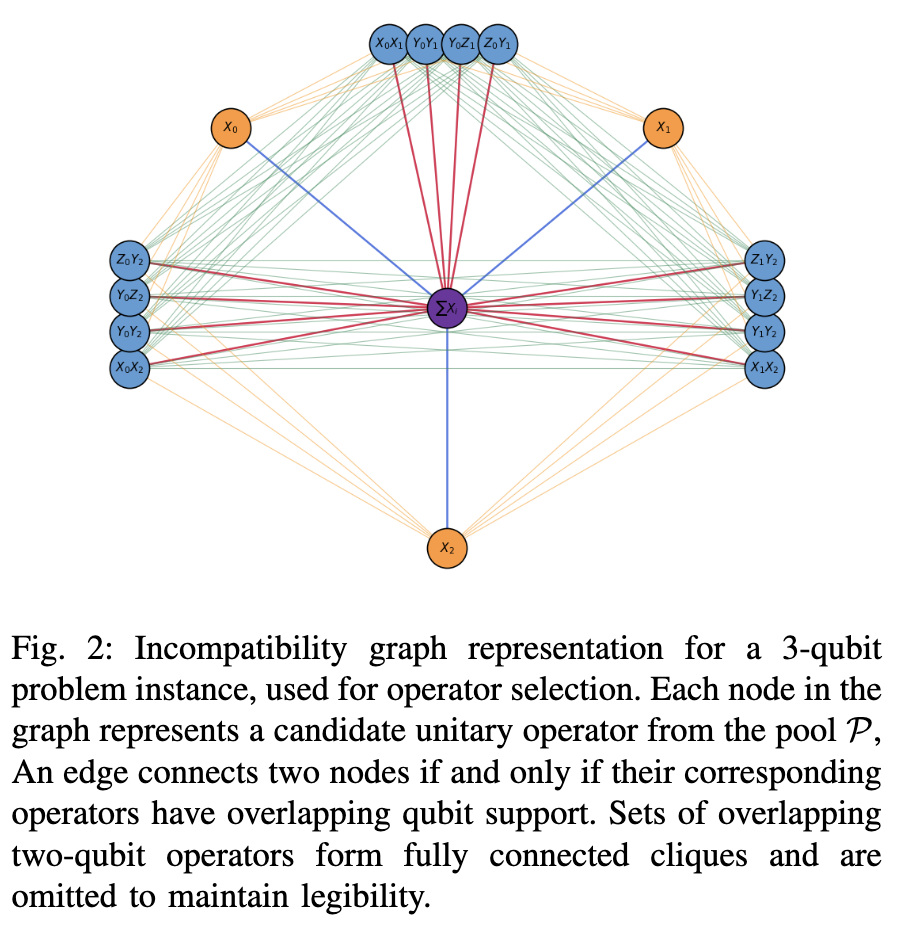

# ADAPT

This is my implementation of [ADAPT-VQE](https://www.nature.com/articles/s41467-019-10988-2).
There are many like it, but this one is mine.

#### Why This Implementation

I like to write code. That's the main reason this one exists. ^_^

In particular, it is meant to address three things I found unsatisfactory in the existing Julia implementation:
1. More thorough awareness of the VQE optimization, ie. whether it "converges" and so on.
2. A "history" that can include a trace over all the optimizations, not just the adaptations.
3. A mechanism for, if it's ever necessary, working with generators that are not necessarily a sum of *commuting* Pauli words.

It is designed to be completely modular and extensible,
    such that different variants of ADAPT can usually be implemented by dropping in a single file,
    plus some very light changes to the main package to include the contents of the file in the package.

#### Where is the Documentation?

At the top of the readme, there is a badge labeled "Dev".

If you click on it, you'll find online documentation that is kept up to date with continuous integration.

I don't know how to use GitHub well enough to know how to get something to happen when you click the "Stable" badge.
That that link is broken should _not_ be interpreted to mean that the code is in some way unstable. ^_^

Anyway, while my overall structure can sometimes get a touch convoluted (the price of modularity and extensibility),
    my docstrings are usually pretty thorough and my code itself is usually relatively readable,
    so it should be a net positive experience. ^_^

#### Overall Structure

Thorough tutorial documentation does not yet exist for this package,
    though looking through scripts in the `test` folder should be edifying.

For now, here's a very brief orientation:

The "main" function in `ADAPT.jl` is `ADAPT.run!()`. The [documentation](https://kmsherbertvt.github.io/ADAPT.jl/dev/#ADAPT.run!-Tuple%7BAbstractAnsatz,%20Dict%7BSymbol,%20Any%7D,%20AdaptProtocol,%20OptimizationProtocol,%20AbstractVector,%20Any,%20Any,%20AbstractVector%7B%3C:AbstractCallback%7D%7D) shows it takes the following arguments:
- `ansatz` - this represents the algorithm's ["state"](https://en.wikipedia.org/wiki/Finite-state_machine) - typcially a sequence of generators ADAPT has selected, together with their variational parameters.
- `trace` - this is just a `Dict` keeping track of useful quantities at each iteration.
- `adapt` - this represents the algorithm for selecting a new generator.
- `vqe` - this represents the algorithm for optimizing a given sequence of generators.
- `pool` - this is a `Vector` of all the possible generators ADAPT can choose from - typically a sequence of commuting Pauli operators.
- `observable` - this represents the algorithm for "measuring" a scalar (e.g. energy) from a quantum state - typically a weighted sum of Pauli operators.
- `reference` - this represents the initial ["state"](https://en.wikipedia.org/wiki/Quantum_state) of the quantum computer, prior to applying the ansatz.
- `callbacks` - this is a `Vector` of objects representing extra steps to do at each iteration - typical runs will want at minimum a `Tracer` and a `ScoreStopper`.

The code in `src/core` defines the, let's say, _schemae_ and _relationships_ for each of these arguments, but no concrete objects.

The code in `src/base` defines concrete objects for the most typical use cases.
Even for atypical use cases, _most_ of these can use the "basic" definitions,
    defined in precisely the way you'll find in the example scripts.

The fun part is figuring out the thing which is unique about your implementation,
    and deciding whether or not you need to implement a new type,
    and deciding which functions need to be overridden for your new type.

# MosaicADAPT-QAOA

This library also contains the implementation of the MosaicADAPT-QAOA algorithm introduced in [Q3SAT-GPT: A Generative Model for Discovering Quantum Circuits for the 3-SAT Problem](https://arxiv.org/abs/2604.27324).

## Method

At each layer of QAOA, MosaicADAPT-QAOA calculates the gradients of all mixer operators like ADAPT-QAOA. However, instead of selecting just one operator at each layer, it selects all disjoint mixer operators at a layer. MosaicADAPT-QAOA formulates disjoint operator selection as a maximum weight independent set problem on an incompatibility graph, where nodes represent mixer operators and edges connect operators with overlapping support. Node weights are kept proportional to the corresponding operator gradients. Then, MosaicADAPT-QAOA uses the [KaMIS MMWIS](https://github.com/KarlsruheMIS/KaMIS) solver to solve this problem.

Another method to select operators is using a greedy strategy (similar to [TETRIS-ADAPT-VQE](https://arxiv.org/abs/2209.10562)). We apply the same strategy to QAOA, and refer to this strategy as TETRIS-QAOA for comparison.

  
  

## Installation 

If the ADAPT library is already installed, then skip to step 5.

1. Create a new python virtual environment, and activate it. Eg. `python3 -m venv venv && source venv/bin/activate`
2. Set the JULIA_PYTHON environment variable to path where the python binary for the virtual environment is `export JULIA_PYTHON="<path to python binary, eg. root_path/venv/bin/python>"`
3. Install the required python packages (Qiskit related), and the Julia package using `make install`
4. Run `make smoke` to execute a simplistic example that runs ADAPT-QAOA. It validates the installation of the library.
5. To clone the KaMIS repo - Run make install-kamis. Depending on the platform being used, KaMIS installation instructions may differ. Please see the [KaMIS installation guide](https://github.com/KarlsruheMIS/KaMIS/tree/master#installation-from-source) for this.
6. Run make smoke-kamis to verify if the integration of this library with KaMIS works.

## Usage 

To run the MosaicADAPT-QAOA, TETRIS-QAOA variants, use the following commands:
1. TETRIS-QAOA (greedy selection): `make run-tetris-qaoa`
2. MosaicADAPT-QAOA (MWIS-based selection): `make run-mosaic-qaoa`

## Max-E3-SAT Hamiltonians
To run the algorithm on Max-E3-SAT Hamiltonians, see the exact and approximate Max-E3-SAT Hamiltonians implemented [here](src/hamiltonians/max3sat.jl). Note that in our paper we use the exact hamiltonian to study the unapproximated optimization dynamics.
